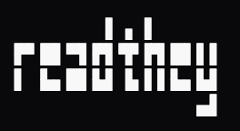
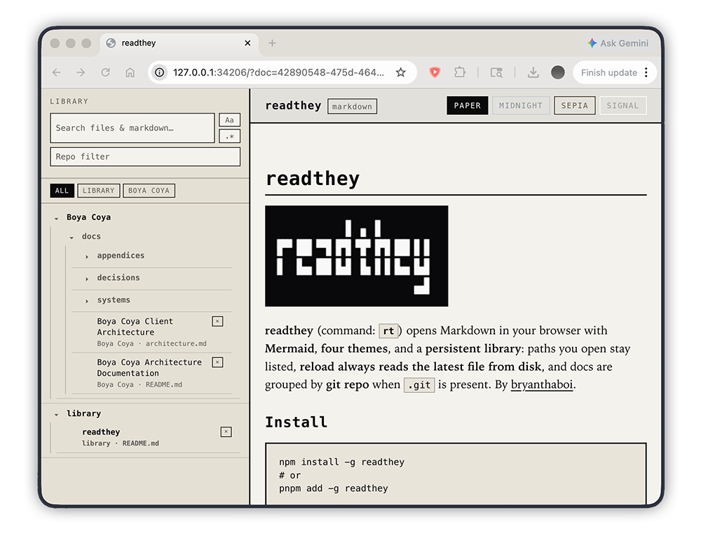
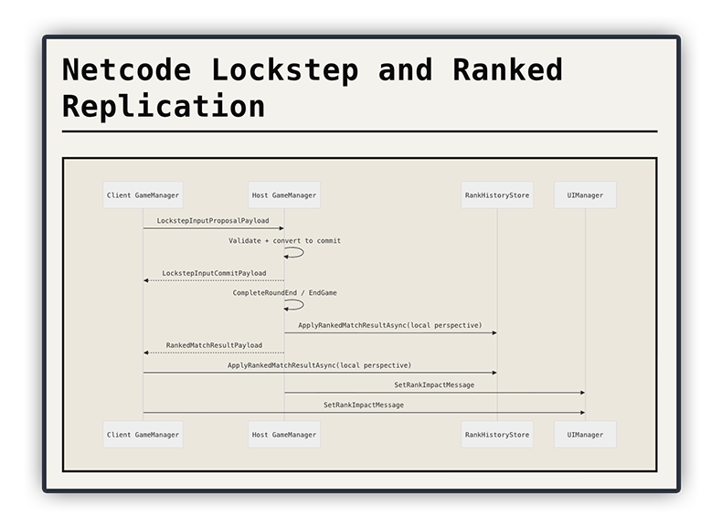

# readthey



**readthey** is a small app for reading Markdown in the browser: comfortable typography, a shelf of everything you’ve opened, diagrams that actually render, and a layout that stays out of your way. Use the command **`readthey`** or the short alias **`rt`**.

By [bryanthaboi](https://github.com/bryanthaboi).



## Install

```bash
pnpm add -g readthey
```

You can also use **`npm install -g readthey`** or **yarn** if you prefer.

## Open a document

From any folder:

```bash
readthey
```

If there’s a README in that folder, it opens; otherwise you can pick a file from the list. You can also open a specific note directly:

```bash
readthey ./notes/ideas.md
rt journal/2025-03.md
```

The first time you run it, readthey starts a quiet background service on your machine. After that, every new file you open appears in the same reader tab you already have—refresh the page anytime; **the file on disk is always what you see**.

To turn the service off when you’re done for the day:

```bash
readthey stop
```

Your library list is saved; nothing is deleted from disk when you stop.

## What you get in the reader

- **Four looks** — *Paper*, *Midnight*, *Sepia*, and *Signal*. Pick one and it sticks the next time you open readthey.
- **A real library** — Every Markdown file you open stays in the sidebar. Remove only drops it from the list; **your file on disk is never deleted**.
- **Folders, not a flat dump** — The sidebar mirrors how your files sit on disk (and groups things by project when you’re inside a git repo). Collapse sections you don’t need; search collapses the list to matches only.
- **Search** — Find notes by title, path, or words inside the Markdown. Optional case-sensitive and regex toggles live next to the search box.
- **Repo tabs** — When you work across several projects, tabs along the top jump between them. They scroll sideways if you have many, and the ones you used most recently drift to the front.
- **Images** — Pictures linked from your Markdown show inline, including images next to your `.md` files.
- **Mermaid diagrams** — Flowcharts, sequence diagrams, and the rest of the Mermaid family render in the page. Each diagram has a **fullscreen** control: open it large, then **drag to pan** and **scroll to zoom** for a clear view.
- **Following links** — Click a relative `.md` link in the text to open that note in the same library. Use **Scan links in doc** at the bottom of the sidebar when you’ve added new links and want every linked note on the shelf in one tap; opening a document also checks for new links automatically.
- **Room to read** — The article column scrolls on its own; the library stays put so you’re never “scrolling away” from your list.

Everything is served at **`http://127.0.0.1:34206`** on your computer—nothing leaves your machine unless you follow an external web link.

## Optional: script line for `package.json`

If you like `package.json` scripts, this prints a ready-made line you can paste into `"scripts"`:

```bash
readthey --command ./docs/guide.md
```

## Where your shelf and theme live

readthey keeps your open documents and theme choice in a small file under your home directory (`.readthey`). Set **`READTHEY_HOME`** to a different folder if you want that data somewhere else.

## Start the server when you log in

The first time you open a note, readthey usually starts its own background server for you. If you want **`readthey server`** to come up automatically whenever you sign in to your computer, run this once (from the same terminal where `readthey` already works):

```bash
readthey boot
```

Shorthand: **`rt --boot`**. It picks the right mechanism for your system—LaunchAgent on Mac, Task Scheduler on Windows, systemd (or a desktop autostart file on Linux).

To turn that off:

```bash
readthey boot --off
# or
readthey --boot-off
```

`readthey stop` still stops the running process; **`boot --off`** removes the login hook so it does not respawn next session. On Linux, if the installer mentions **linger**, that optional `loginctl` step lets your user session start earlier at boot so the server can be up before the graphical login on some setups.

## Themes

- **Paper** — bright, paper-like reading  
- **Midnight** — dark and easy in low light  
- **Sepia** — warm, bookish  
- **Signal** — bold, high-contrast dark  

## Mermaid

Use fenced code blocks with the `mermaid` tag in your Markdown—flowcharts, timelines, sequence diagrams, and more.



## License

MIT — see [LICENSE](LICENSE).
